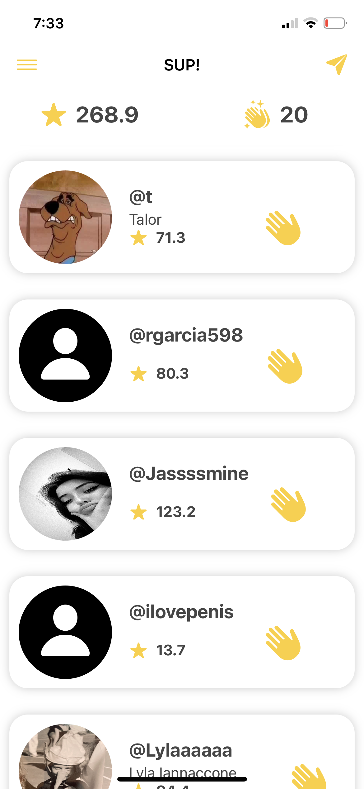
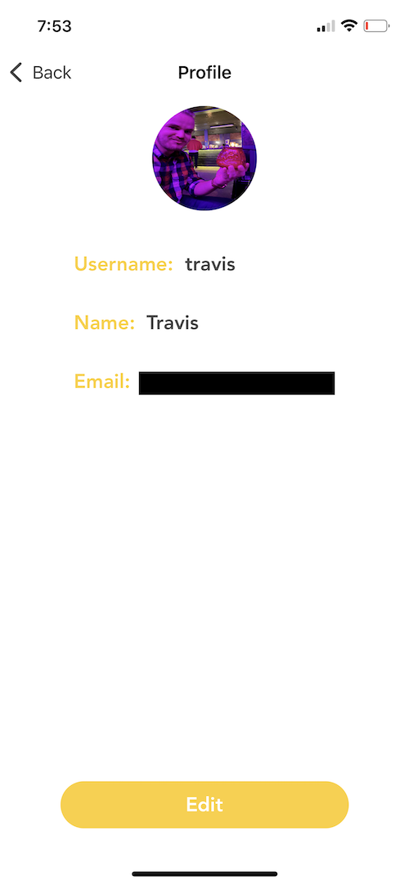
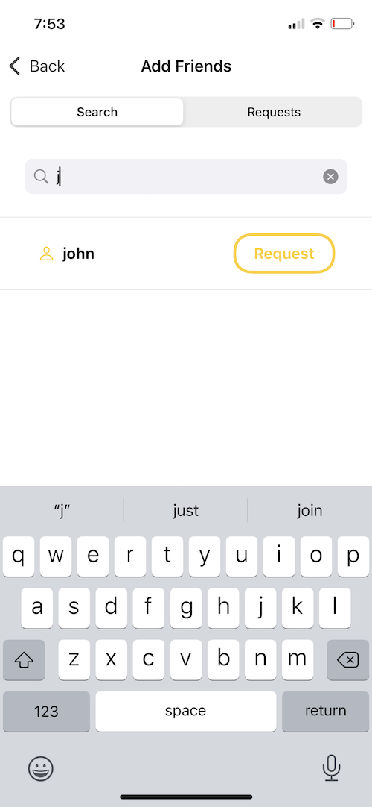

# sup

sup is a simple iOS app built using SwiftUI and Firebase. The premise was built of the old Yo! app but with a twist. Users can send notifcations to other
userss of the app but the only content of the message they can send is SUP!. The twist is that you only have a certain ammount of sups to send per day,
and you get points by sending sups.

### Features
- Login/Signup
- Forgot Password
- Send SUP!
- Profile Pictures
- Update email
- Update username
- Recent Activity Feed
- Delete Account
- Search Users
- Request Friend
- Accept Friend Request

### Screenshots

